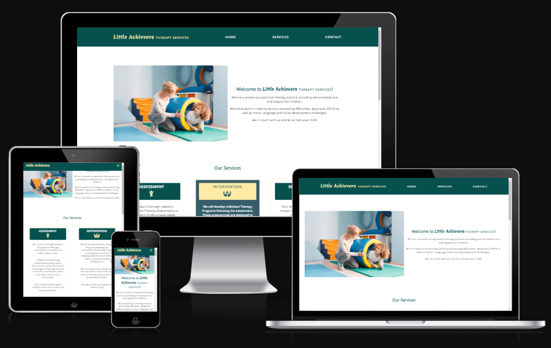
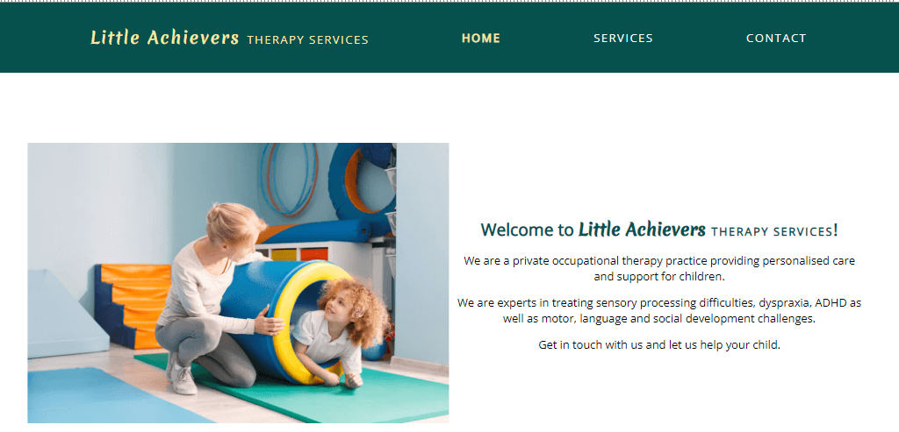
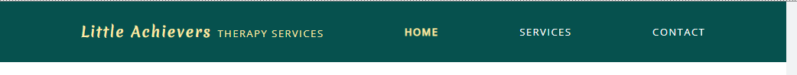
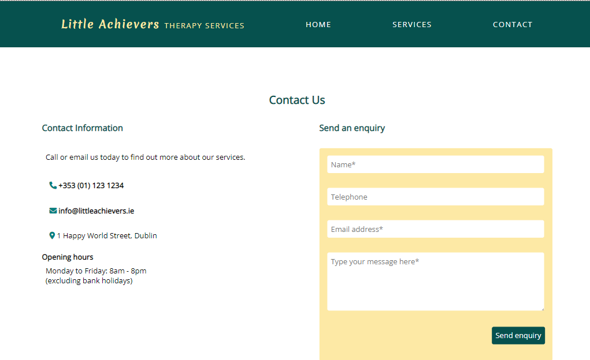
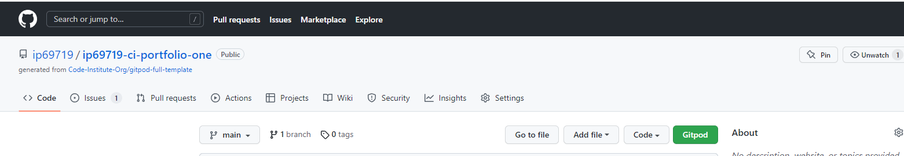
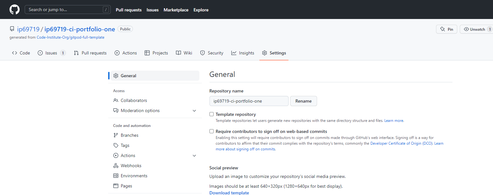
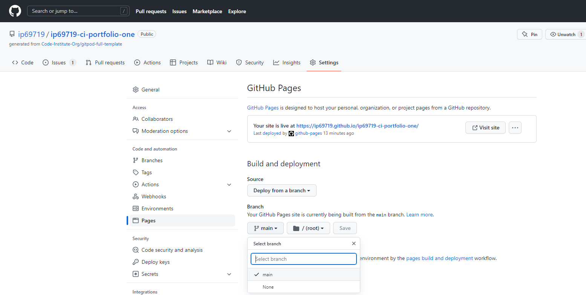
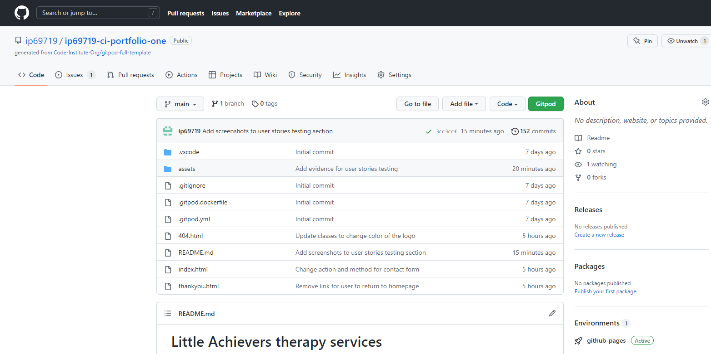
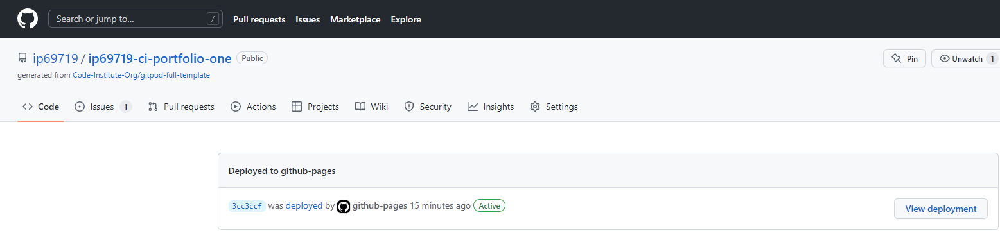

# Little Achievers therapy services

[Link to the live project](https://ip69719.github.io/ip69719-ci-portfolio-one/)

## Project Overview

This project was created for an imaginary practice that offers occupational therapy services for children.

## UX

### Project Goals

The primary Project Goal is to create a marketing website for 'Little Achievers therapy services', a private paediatric occupational therapy practice.
The target audience are parents whose children experience development challenges.

### User Stories

*   User stories
    * First Time Visitor Goals
        * As a First Time Visitor, I want to understand the main purpose of the site and learn more about the organisation.
        * As a First Time Visitor, I want to be able to easily navigate throughout the site to find content.
        * As a First Time Visitor, I want to easily locate organisation's contact details.

### Design choices

#### Typography

* Merienda One font was used to create an attractive and slightly playful logo for the site.
* The Open Sans font is the main font used throughout the whole website because it is simple and makes the page content easily readable. Open Sans was chosen for its legibility across web and mobile interfaces. The font is highly readable in small sizes and also looks great when used for headings.
* The space between letters was increased for headings to improve the readability of uppercase text.

#### Images

* Images were selected to support the project goal. The aim is to show children having fun during therapy sessions

### Wireframes

* [Wireframes ](https://github.com/ip69719/ip69719-ci-portfolio-one/tree/main/assets/docs/wireframes)

## Features

## Technologies used

### Languages used

* [HTML5](https://en.wikipedia.org/wiki/HTML5)
* [CSS3](https://en.wikipedia.org/wiki/CSS)

### Frameworks, Libraries & Programs Used

* [Google fonts](https://fonts.google.com/) were used to import the 'Merienda One' and 'Open Sans' fonts into the style.css file which is used on all pages throughout the project.

* [Font Awesome](https://fontawesome.com/) was used to obtain icons for the website.

* [Google Developer Tools](https://developer.chrome.com/docs/devtools/) was used for testing responsiveness of the website.

* [WebAIM](https://webaim.org/resources/contrastchecker/) was used for checking the colour contrast.

* [TinyPNG](https://tinypng.com/) was used to optimise images for the web.

* [Git](https://git-scm.com/) was used for version control by utilizing the Gitpod terminal to commit to Git and Push to GitHub.

* [GitHub](https://github.com/) is used to store the projects code after being pushed from Git.

## Testing

### Validation Testing

* The W3C Markup Validator and W3C CSS Validator Services were used to validate the project to ensure there were no syntax errors.

    * W3C Markup Validator - [Results](https://github.com/ip69719/ip69719-ci-portfolio-one/blob/main/assets/docs/testing/w3c_markup_validation%20results.pdf)

    * W3C CSS Validator - [Results](https://github.com/ip69719/ip69719-ci-portfolio-one/blob/main/assets/docs/testing/w3c_css_validation%20results.pdf)

### Manual Testing

* Navigation links were tested to confirm that User is brought to the relevent section of the webpage when any of the links is clicked.
* Testing was carried out to confirm that when User clicks on the social media icons in the footer the link to social media account opens in a new tab.
* Testing was performed on contact form to ensure that User input is validated before the form can be submitted: required fields cannot be empty, email address is in the expected format:
    * [Name](https://github.com/ip69719/ip69719-ci-portfolio-one/blob/main/assets/docs/testing/name_field.png)
    * [Email address field](https://github.com/ip69719/ip69719-ci-portfolio-one/blob/main/assets/docs/testing/email_field.png)
    * [Message field](https://github.com/ip69719/ip69719-ci-portfolio-one/blob/main/assets/docs/testing/message_field.png) 

### User Story testing

* **As a First Time Visitor, I want to understand the main purpose of the site and learn more about the organisation.**
As soon as the page is opened User is presented with a welcome message that states the purpose of the organisation and describes its main services.

    

* **As a First Time Visitor, I want to be able to easily navigate throughout the site to find content.**
The website has a navbar at the top of the page. When any of the nav links is clicked the User can easily get access to relevant section of the page.

    

* **As a First Time Visitor, I want to easily locate organisation's contact details.**
There is contact navigation link on the top of the page that brings the User to the contacts section. Here the User can view the full contact details and/or can submit a query to the organisation by filling out the form.

    

### Defect Tracking

* Issues are tracked on [GitHub](https://github.com/ip69719/ip69719-ci-portfolio-one/issues?q=is%3Aissue+is%3Aopen).

## Deployment

The project was deployed to GitHub Pages using the following steps:

1. Log in to GitHub and locate the repository you want to deploy [GitHub Repository](https://github.com/ip69719/ip69719-ci-portfolio-one).

1. In the menu located at the top of this section, click on the 'Settings' icon.

    

1. Click on the Pages link on the left menu bar.

    

1. Locate the Build and deployment section on the right. Under "Branch", click the dropdown and select "main" Branch and "/root" folder and then save.

    

1. Return to your repository's main page, locate Environments and click on github-pages pages next to the green Active button.

    

1. Click on View Deployment on the right hand side.

    

1. The resulting page that comes up is your [website](https://ip69719.github.io/ip69719-ci-portfolio-one/)

## Credits

### Content

* The page content was written based on information contained on [OT for kids](https://www.otforkids.co.uk/index.php) and  [Little Achievers Occupational Therapy](https://www.littleachievers.com.au/) websites.

* Content of READ.md was written with reference to [this](https://github.com/maliahavlicek/ci_mentor_insights/blob/main/PORTFOLIO_1_CSS_HTML_ESSENTIALS.md) template compiled by [Malia Havlicek](https://github.com/maliahavlicek). 

### Media

* Images were sourced from [Shutterstock](https://www.shutterstock.com/home).

### Code

* Responsive Navigation based on Malia Havlicek's [codepen](https://codepen.io/maliahavlicek/pen/LYeBwNY).
* Learned how to target a css class inside another css class from this [Stack Overflow](https://stackoverflow.com/questions/8965063/target-a-css-class-inside-another-css-class) post.
* Learned about CSS Flexible Box Layout model from [Understanding Flexbox: Everything you need to know](https://www.freecodecamp.org/news/understanding-flexbox-everything-you-need-to-know-b4013d4dc9af/) article by Emmanuel Ohans.
* Learned how to create a "fixed" menu with CSS from this [W3 schools](https://www.w3schools.com/howto/howto_css_fixed_menu.asp#gsc.tab=0) tutorial.
* Learned how to use :nth-child selector from this [CSS-Tricks](https://css-tricks.com/almanac/selectors/n/nth-child/) article.

### Acknowledgements

* Special thanks to my Mentor [Malia Havlicek](https://github.com/maliahavlicek) for support and guidance during this project.